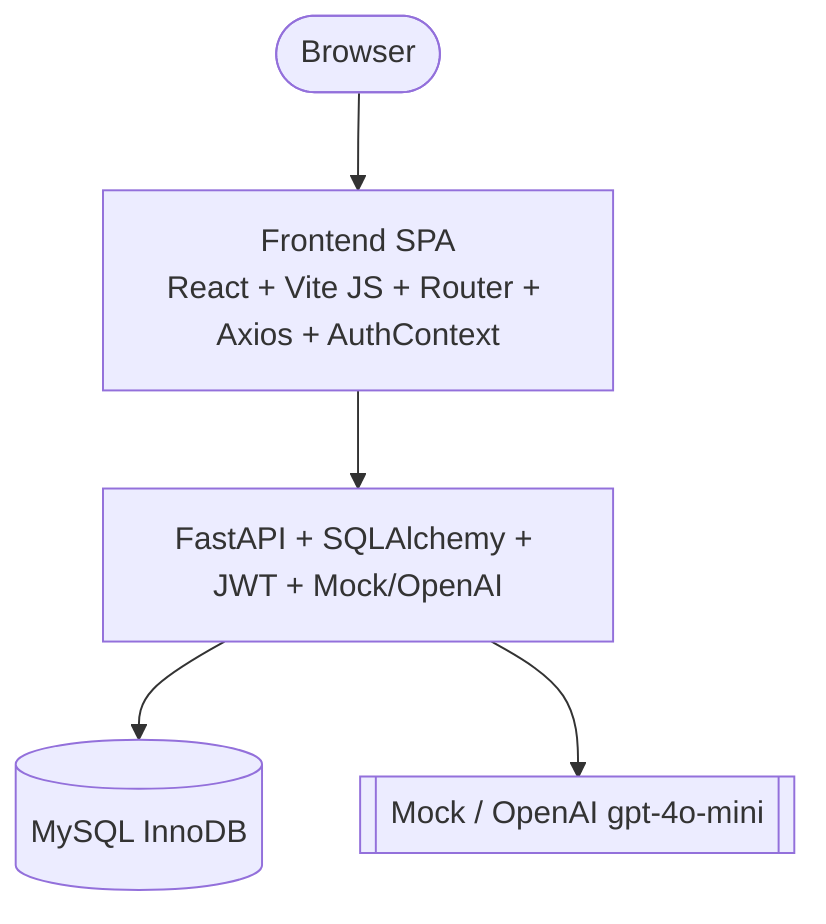

# Content Intelligence Platform

> Paste textual content → AI analyzes & transforms → review, edit, save structured outputs. Source always preserved.

[]() []() []()

---

## Problem

Organizations produce articles, reports, announcements daily. Teams need to repurpose the same content for different audiences — summaries for newsletters, key points for slides, FAQs for help sites, social posts for channels, executive summaries for leadership. Manual repurposing is slow, inconsistent, and disconnected.

## Solution

**Content Intelligence Platform** — full-stack MVP (Modules 01-08):

1. **Paste → Save** with tags (`POST /api/content`, auto-title, tag dedup)
2. **Analyze** with AI → summary, keyPoints, keywords, topics, suggestedTags (`POST /api/content/:id/analyze`, 5 outputs, mock + OpenAI)
3. **Review & Edit** every AI output (`PUT /api/outputs/:id` raw preserved, edited separately)
4. **Transform** selective → FAQ (3), Social ≤280, Executive 122w (`POST /api/content/:id/transform`)
5. **History** — list/search/tag filter/pagination, detail, ownership 403, soft delete

Source content is never overwritten. Every output is `raw_ai_content` + optional `edited_content`, owned per user, traceable via `content_id` FK, InnoDB MySQL.

---

## Features

### Completed (Modules 01-08)
- Auth JWT (register/login/me/refresh/logout, bcrypt, 409/401) — M03
- Content CRUD (create/list/detail/edit/delete, search/tag filter, soft delete, 403 isolation) — M04
- AI Analysis 5 types + Transform 3 types (selective, validation, mock 4ms, total 8 outputs) — M05/M06
- Frontend integration (Login/Register/Dashboard/Create/List/Detail with Analyze/Transform/Edit/Copy) — M07
- Polish (Toast/Skeleton/EmptyState/ErrorBanner/ConfirmModal/404, build 239k) — M08

### Out of Scope
- Video, auto social publishing/scheduling, enterprise CMS, large-scale storage

---

## AI Capabilities

- **Analysis:** `POST /api/content/:id/analyze` → 5 outputs via `AnalysisResult` (Zod-like), truncate 15k, mock deterministic, OpenAI JSON mode `gpt-4o-mini` when `AI_API_KEY` set.
- **Transformation:** `POST /api/content/:id/transform` `types:[FAQ,SOCIAL_POST,EXECUTIVE_SUMMARY]` selective, `TransformResult` (FAQ 3, social ≤280, exec 120-180), upsert per `OutputType`.
- **Provider:** `app/ai/provider.py` `get_provider()` mock vs OpenAI, `validator.py`, `prompts.py` hallucination guard.
- **Review:** `raw_ai_content` immutable, `edited_content` via `PUT /outputs/:id`, toggle in FE `AI Generated/Edited`.

---

## Screenshots

> TODO — capture after `npm run dev` + `uvicorn` demo (Dashboard / Create / List / Detail with outputs)

| Create | History | Detail + AI | Output Edit |
|--------|---------|-------------|-------------|
|  |  |  |  |

## Demo

- **Local:** FE `http://localhost:5173` + BE `http://localhost:8000` + docs `http://localhost:8000/docs`
- **Demo accounts:** `alice@example.com / pass1234`, `bob@example.com / pass1234` (also `maya2@example.com` from M03)
- **60s script:** Login → Create (paste 50+ chars) → Save → Detail → Analyze (5) → Review → Transform FAQ+Social (or Exec) → Edit output → Save → Copy → Back to History → Logout
- **Verification:** `GET /api/health → {"status":"ok"}`, `vite build 239k`, MySQL `users,contents,tags,content_tags,generated_outputs` InnoDB

---

## Architecture



- See `docs/ARCHITECTURE.md` for original diagrams (adapted to FastAPI+MySQL per Module 01).
- **Frontend:** React 18, Vite 5, JS, React Router 6, Axios, AuthContext, Toast
- **Backend:** Python, FastAPI 0.110, Uvicorn, SQLAlchemy 2.0, PyMySQL, Alembic, Pydantic 2, passlib bcrypt, PyJWT, OpenAI 3.17
- **DB:** MySQL `content_intelligence` InnoDB utf8mb4 (5 tables, FK CASCADE)
- **AI:** Mock (default) + OpenAI provider abstraction

## Tech Stack

| Layer | Tech |
|-------|------|
| FE | React 18, Vite 5, JS, React Router 6, Axios |
| BE | FastAPI 0.110, Uvicorn 0.29, SQLAlchemy 2.0, PyMySQL, Alembic 1.20, Pydantic 2, passlib bcrypt, PyJWT, OpenAI |
| DB | MySQL InnoDB |
| AI | Mock + OpenAI (via `AI_API_KEY`) |

## Project Structure

```
.
├── docs/            # PRD, ARCHITECTURE, DATABASE, AI_ARCHITECTURE, API_SPEC, DESIGN, RULES, TASKS, MEMORY
├── frontend/        # React SPA — src/{pages,components,context,services,layouts}
│   ├── src/pages/{Login,Register,Dashboard,ContentList,CreateContent,ContentDetail,NotFound}.jsx
│   ├── src/components/{Toast,Skeleton,EmptyState,ErrorBanner,ConfirmModal,ProtectedRoute}.jsx
│   └── vite.config.js
├── backend/         # FastAPI — app/{api/routes,core,models,schemas,ai}
│   ├── app/models/{user,content,tag,content_tag,generated_output}.py
│   ├── app/ai/{provider,mock,prompts,validator}.py
│   ├── app/api/routes/{health,auth,content,tags,ai,outputs}.py
│   ├── alembic/ + init_db.py + requirements.txt
├── database/README.md
├── AGENTS.md
└── README.md
```

---

## Setup

### Prerequisites
- Node 18+, npm 9+
- Python 3.11+, pip
- MySQL 5.7+ (DB `content_intelligence` exists, see `backend/.env.example`)
- Optional: OpenAI API key for live AI (else mock)

### Local Development

```bash
# 1. Clone
git clone <TODO> && cd "MCA Hackathon"

# 2. Backend
cd backend
copy ..\.env.example .env  # or create .env from backend/.env.example — fill MYSQL_* , JWT_SECRET
pip install -r requirements.txt
python init_db.py          # creates 5 InnoDB tables (or alembic upgrade head)
uvicorn app.main:app --reload --host 127.0.0.1 --port 8000  # http://localhost:8000/docs

# 3. Frontend (new terminal)
cd ../frontend
npm install
npm run dev                # http://localhost:5173  (VITE_API_BASE_URL=http://localhost:8000/api)

# 4. Verify
curl http://localhost:8000/api/health  # {"status":"ok"}
npm run build              # 239k 78k gzip 104 modules
```

### Environment Variables

**Frontend `frontend/.env.example`:**
```
VITE_API_BASE_URL=http://localhost:8000/api
```

**Backend `backend/.env.example`:**
```
APP_NAME=Content Intelligence Platform
ENVIRONMENT=development
HOST=0.0.0.0
PORT=8000
MYSQL_HOST=localhost
MYSQL_PORT=3306
MYSQL_DATABASE=content_intelligence
MYSQL_USER=root
MYSQL_PASSWORD=
JWT_SECRET=change_me_min_32_chars
AI_API_KEY=          # empty → mock, or sk-... → OpenAI
AI_MODEL=gpt-4o-mini
```

### Database Setup

```bash
cd backend
python init_db.py
# or
alembic revision --autogenerate -m "change"
alembic upgrade head
# check
python -c "from app.core.database import engine; from sqlalchemy import inspect; print(inspect(engine).get_table_names())"
# ['content_tags','contents','generated_outputs','tags','users']
```

### AI Configuration

- Without `AI_API_KEY`: mock (4ms, 5+3 outputs, 123w exec)
- With key: `AI_API_KEY=sk-...` + `AI_MODEL=gpt-4o-mini` → OpenAI JSON mode, 25s timeout

### Testing (manual Module 08)

```bash
# backend health
curl http://localhost:8000/api/health
# auth + content + AI via HTTP (see docs/API_SPEC.md)
# frontend
npm run build
```

### Deployment (suggested)

- **FE:** Vercel → `VITE_API_BASE_URL` = `https://api.example.com/api`
- **BE:** Render/Railway → env `MYSQL_*`, `JWT_SECRET`, `AI_*`, `HOST/PORT`, run `python init_db.py`
- **DB:** Managed MySQL (e.g., PlanetScale/RDS)

---

## Hackathon Info

- **Problem set:** `Hackathon Problem Statements - MCA 2nd Year.pdf`
- **Constraints:** Source separation, editable outputs, history, ownership, traceability — all enforced (see `docs/RULES.md` D1,A2,S6).
- **Modules 01-08 done** (see `docs/TASKS.md` M01-M08, `docs/MEMORY.md` changelog).

## Future (post-MVP)

- FE tests (Vitest), rate-limit, file upload, pagination cursor, version history, export PDF.

## License

MIT (or per hackathon rules) — TODO.
