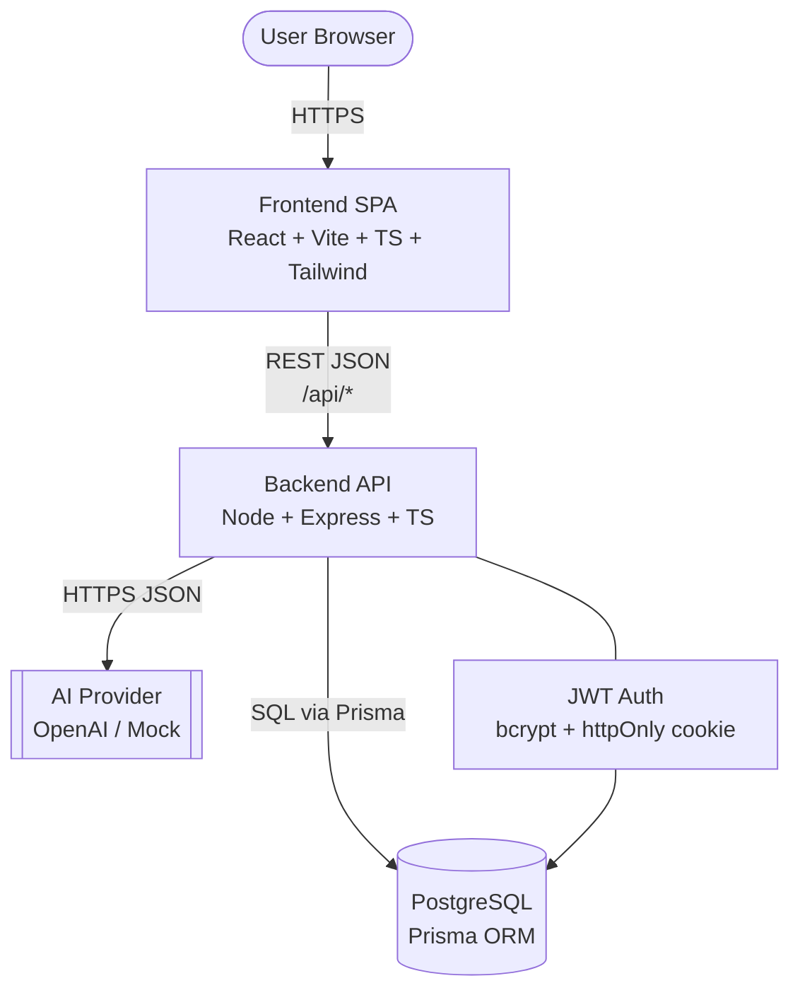
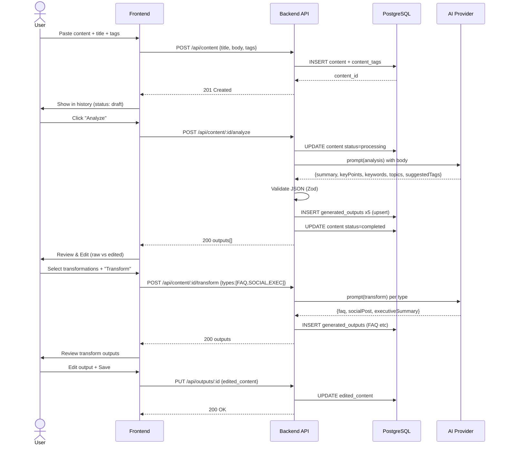
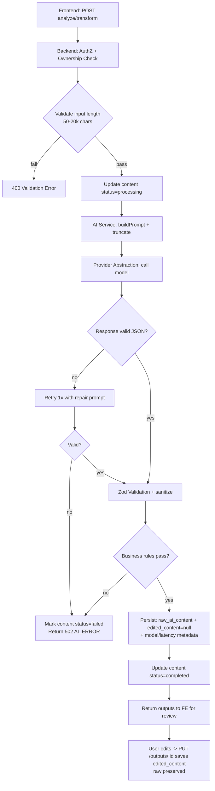
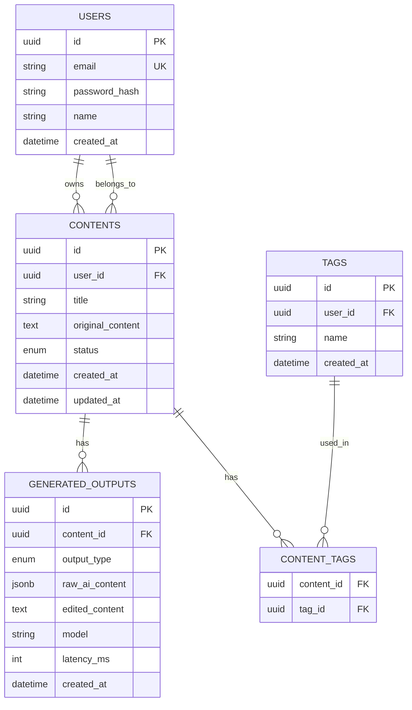

# ARCHITECTURE — Content Intelligence Platform

**Version:** 1.0.0  
**Date:** 2026-09-22  
**Stack Decision Record:** Preferred stack for hackathon velocity + demo quality

---

## 1. High-Level Architecture

### 1.1 Overview
Single logical app split into 3 deployable units: **Frontend (SPA)**, **Backend API (stateless)**, **PostgreSQL**. AI is an external service called via provider abstraction (OpenAI-compatible). No separate worker for MVP; backend calls AI synchronously with timeout/retry, persists results, returns to frontend.

### 1.2 System Diagram

### 1.3 User Content-Processing Flow

### 1.4 AI Generation Flow (detailed)

### 1.5 Database Relationship Overview

---

## 2. Technology Stack

### 2.1 Chosen Stack (recommended)

| Layer | Technology | Version | Why |
|-------|------------|---------|-----|
| **Frontend** | React + Vite + TypeScript (strict) | React 18+, Vite 5 | Fastest hackathon SPA, HMR, strong TS, huge ecosystem |
| **UI** | Tailwind CSS + shadcn/ui + lucide-react | Tailwind 3.x | Professional SaaS look in hours, not days; accessible primitives |
| **State/Data** | TanStack Query + Zustand + React Router v6 | Latest | Query handles server cache/loading/error; Zustand for auth/ui; Router for SPA |
| **Backend** | Node.js + Express + TypeScript | Node 20 LTS, Express 4 | Minimal boilerplate, easy AI SDK integration, team familiarity |
| **ORM** | Prisma | 5.x | Type-safe, migrations, great DX; abstracts Postgres/SQLite swap |
| **Database** | PostgreSQL (production) / SQLite (local fallback) | PG 15 | Relational integrity for ownership/FK; Prisma makes swap painless |
| **Auth** | JWT (access 15m + refresh 7d) + bcrypt + httpOnly cookie | - | Stateless, secure, demo-friendly; cookie prevents XSS theft vs localStorage |
| **Validation** | Zod (shared FE/BE) + zod-prisma | - | Single schema source, runtime safety for AI JSON |
| **AI** | OpenAI SDK (`openai` npm) behind `AIProvider` interface + Mock provider | - | Swap model without code change; mock allows offline demo |
| **Testing** | Vitest + Supertest + React Testing Library | - | Fast, Vite-native, easy coverage |
| **Lint/Format** | ESLint + Prettier + Husky | - | Consistency for vibe coding |
| **Deployment** | Frontend: Vercel; Backend: Render/Railway; DB: Neon/Supabase | - | Free tiers, 5-min deploys, PG-compatible |
| **Monitoring** | pino logger + request-id + health endpoint | - | Structured logs for debugging demo |

### 2.2 Alternatives Considered & Rejected
- **Next.js** – heavier for pure SPA demo; Vite simpler.
- **NestJS** – over-engineered for MVP; Express faster to hack.
- **MongoDB** – loses FK ownership guarantees; relational fits business rules better.
- **LangChain** – unnecessary abstraction for 2 prompts; direct SDK keeps control.

### 2.3 Why This Stack Fits Hackathon
- **Fast dev:** Vite + Tailwind + Prisma = scaffold to CRUD in <2 hrs.
- **Reliability:** TS strict + Zod + FK constraints prevent overwrite bugs.
- **AI integration:** OpenAI SDK JSON mode is trivial; abstraction allows mock without key.
- **Easy deployment:** Vercel+Render+Neon all have one-click PG + env vars.
- **Demo quality:** shadcn gives SaaS polish without designer.

---

## 3. Frontend Architecture

- **Structure:** `frontend/src/{components, pages, hooks, services, stores, lib, types}`
- **Pages:** `/login`, `/register`, `/dashboard`, `/content/new`, `/content/:id`, `/content` (history)
- **Components:** `ContentEditor`, `AIProcessingButton`, `OutputCard` (with Edit/Save/Copy), `TagInput`, `StatusBadge`, `LoadingSkeleton`, `EmptyState`
- **Data flow:** TanStack Query for GET list/detail/outputs; mutations for create/update/analyze/transform; optimistic update for tag edit.
- **Auth:** `AuthContext` holds user; router guards redirect to `/login`; token in httpOnly cookie (or Bearer fallback for API testing).
- **AI UX:** Explicit "Analyzing…" spinner + progress; results appear as cards with `raw` badge and Edit CTA; never auto-finalizes.

## 4. Backend Architecture

- **Structure:** `backend/src/{routes, controllers, services, middleware, lib/ai, lib/validation, prisma}`
- **Layers:**
  - `routes` → `controllers` (thin) → `services` (business logic) → `prisma` (DB) + `aiProvider` (AI)
  - `middleware`: `auth`, `ownershipCheck`, `validateRequest`, `errorHandler`, `rateLimiter`
- **AI module:** `lib/ai/{provider.ts, prompts.ts, validator.ts, mock.ts}` — isolated from content service.
- **Stateless:** No session store; JWT verified per request; horizontal scale via `DATABASE_URL`.
- **Error handling:** Central error middleware maps to `{error, code, details}` JSON; AI errors → 502 with `AI_ERROR`.

## 5. Database (summary — see DATABASE.md)
- PG with Prisma; FKs with `ON DELETE CASCADE` for outputs/tags; unique `(user_id, lower(name))` for tags; GIN index on title/body for search (optional).

## 6. Authentication
- Email/password signup → bcrypt hash → JWT access+refresh.
- Protected routes: all `/api/content/*` and `/api/outputs/*` require `Authorization: Bearer` or cookie.
- Ownership middleware: `content.user_id === req.user.id` else 403.

## 7. API Layer
- Base: `/api`
- Versioning: `/api/v1` (alias `/api` for MVP)
- Conventions: REST JSON, Zod validation, pagination `?page&limit`, filtering `?tag&search`, standard error envelope.
- See `API_SPEC.md` for full endpoint list.

## 8. Data Flow (end-to-end)
1. User pastes content → FE validates (Zod) → POST → BE validates → DB insert → 201.
2. User triggers AI → BE checks ownership → builds prompt (truncate to 15k chars) → calls provider → validates JSON → persists outputs (upsert by type) → returns.
3. User edits output → PUT → BE validates ownership via content → updates `edited_content` only → returns.
4. History: GET list with pagination/filter → FE renders status badges + last updated.

## 9. Error Handling
- **Validation:** 400 with `details: [{path, message}]`.
- **Auth:** 401 (missing/invalid token), 403 (wrong owner).
- **Not found:** 404.
- **AI:** 502 `AI_ERROR` with `retryable: true`, logs model/latency; FE shows retry button.
- **Rate limit:** 429.
- **Fallback:** FE shows toast + inline error; never loses user's typed content (local state).

## 10. Security
- Helmet, CORS (allow frontend origin only), rate limit (60/min), Zod sanitization, Prisma parameterized queries (no SQL injection), bcrypt, JWT secret via env, AI key never exposed to FE, logs redact secrets.

## 11. Deployment
- **Frontend:** `vite build` → Vercel (env `VITE_API_URL`).
- **Backend:** `tsc` build → Docker or Render (env `DATABASE_URL`, `JWT_SECRET`, `AI_API_KEY`, `AI_MODEL`).
- **DB:** Neon/Supabase PG; migrations via `prisma migrate deploy`.
- **Env:** See `.env.example`.

## 12. Monitoring / Logging
- `pino` JSON logs with `requestId`, `userId`, `contentId`, `model`, `latencyMs`, `tokens`.
- `GET /api/health` → `{status, uptime, db: ok, ai: ok/mock}`.
- Frontend: error boundary + console error for AI failures.

---

## 13. Constraints & Compliance
- Original vs generated separation enforced at code + DB level (see RULES.md).
- No large-file storage; `original_content` is TEXT, capped 20k chars.
- All generated outputs traceable via `content_id` FK.

