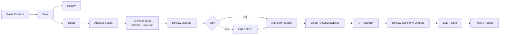

# DESIGN — Content Intelligence Platform

**Version:** 1.0.0  
**Date:** 2026-09-22  
**Vibe:** Modern SaaS — clean, minimal, AI-focused, professional. Not a CRUD demo.

---

## 1. Design Principles

- **Clarity over cleverness:** Workflow `CREATE → ANALYZE → REVIEW → TRANSFORM → EDIT → SAVE` is always visible (stepper/progress).
- **Source/output separation:** Original content has distinct panel/card with subtle border; AI outputs have "AI Generated" badge + raw/edited toggle.
- **Editable by default:** Every AI card has Edit CTA, not hidden in menu.
- **Fast workflow:** Max 2 clicks to generate; no modals for primary flow except review confirmation.
- **Responsive:** Mobile-first 360px → 1440px; no horizontal scroll.
- **Accessible:** WCAG AA, focus rings, ARIA for loading, keyboard nav.
- **Minimal motion:** Only spinner/skeleton + 150ms hover; no excessive animations.

---

## 2. Visual System

### 2.1 Color Palette
- **Primary:** `#111827` (gray-900) — headers, primary buttons
- **Accent:** `#6366F1` (indigo-500) — AI actions, links, active states
- **Accent-hover:** `#4F46E5` (indigo-600)
- **Success:** `#10B981` (emerald) — completed status, save toast
- **Warning:** `#F59E0B` (amber) — processing
- **Danger:** `#EF4444` (red) — failed/delete
- **Background:** `#F9FAFB` (gray-50) page, `#FFFFFF` cards
- **Border:** `#E5E7EB` (gray-200)
- **Text:** `#111827` primary, `#6B7280` secondary, `#9CA3AF` muted

### 2.2 Typography
- **Font:** `Inter` (Google Fonts) for UI; `JetBrains Mono` for code/metadata.
- **Scale:** 
  - `text-xs` 12px badges, `text-sm` 14px body, `text-base` 16px content, `text-lg` 18px card titles, `text-2xl` 24px page titles.
  - Line height 1.6 for content.
- **Weight:** 600 for titles, 500 for card headers, 400 for body.

### 2.3 Spacing & Radius
- **Spacing unit:** 4px; section `p-6`/`gap-6`, card `p-5`, between cards `gap-4`.
- **Radius:** `rounded-lg` (8px) cards, `rounded-full` badges, `rounded-md` inputs/buttons.
- **Shadow:** `shadow-sm` cards, `shadow-md` on hover, `shadow-lg` modals.

### 2.4 Components
- **Buttons:** Primary (solid indigo), Secondary (outline), Ghost, Destructive; `h-9`/`h-10`, loading spinner inside.
- **Cards:** White, border gray-200, `p-5`, header with icon+title+action.
- **Forms:** Label `text-sm font-medium`, input `h-10 border rounded-md px-3 focus:ring-2 focus:ring-indigo-500`.
- **Tabs:** Underline active (indigo), for Analysis vs Transform outputs.
- **Badges:** `status` (draft gray, processing amber pulse, completed emerald, failed red), `AI Generated` (indigo outline), `Edited` (emerald).
- **Tags:** `rounded-full bg-gray-100 px-3 py-1 text-sm`, editable with × remove.
- **AI Indicator:** Indigo spinner + "Analyzing with AI… 15s avg" + skeleton for cards.
- **Toasts:** Bottom-right, auto-dismiss 3s, success/error/warning variants.
- **Modals:** Centered, backdrop `bg-black/50`, `max-w-lg`.

---

## 3. Information Architecture

```
/login — /register
/dashboard
  -> stats (total contents, outputs, recent)
  -> quick "New Content" CTA
/content  (History/List)
  -> search, filter by tag/status, pagination
  -> row: title, snippet, tags, status badge, date, open
/content/new  (Creation)
  -> editor, title, TagInput, Save, Analyze CTA
/content/:id  (Details)
  -> Left: original content (editable, Save)
  -> Right: tabs [Analysis] [Transformations] + Generate buttons
  -> Bottom: outputs grid (cards)
  -> Each output card: raw/edited toggle, Edit, Save, Copy, Regenerate
```

---

## 4. Screens

### 4.1 Login / Register
- **Purpose:** Auth gate to enforce ownership.
- **Layout:** Centered card `max-w-md`, logo top, tabs Login/Register, form (name/email/password), submit, link footer, demo hint "Seed demo: maya@example.com / demo123".
- **Components:** Input, Button (loading), Alert for error, Link.
- **States:** Loading (button spinner), Error (inline + toast), Empty N/A, Success (redirect to /dashboard).
- **Responsive:** Full width on mobile with `p-4`.

### 4.2 Dashboard
- **Purpose:** Landing after login; quick stats + workflow entry.
- **Layout:** Top: greeting + "New Content" primary CTA. Grid 3 stats cards (Total Contents, AI Outputs, Recent). Below: Recent contents table (5 rows) with status.
- **Actions:** Click New Content → `/content/new`; click recent → `/content/:id`.
- **Empty:** Illustration + "No content yet — create your first" with CTA.
- **Loading:** Skeleton for stats.

### 4.3 Content Creation (`/content/new`)
- **Purpose:** Paste/save content, add tags, start AI.
- **Layout:** Two-column on desktop (editor left 60%, meta right 40% stacked to single on mobile).
  - Left: Title input, Textarea (min 300px, char count `0/20000`, word count), Save button.
  - Right: TagInput (type + Enter, chips with ×), AI hint card ("After saving, click Analyze").
- **Actions:** Save → POST, success toast, enable Analyze button; Analyze → POST analyze, loading state.
- **Loading:** Save spinner; Analyze shows full-page spinner overlay on outputs area.
- **Empty:** Placeholder "Paste your article, report, or announcement here…".
- **Error:** Inline under textarea; toast on API fail.
- **Success:** Redirect to `/content/:id` after save.

### 4.4 Content List / History (`/content`)
- **Purpose:** Browse own contents, filter, see status.
- **Layout:** Header with Search input + Tag filter dropdown + Status tabs (All/Draft/Processing/Completed) + New Content button. Below: List as cards (mobile) / table (desktop).
  - Card: Title, snippet 120 chars, tags row, status badge, date, chevron.
- **Actions:** Search (debounced 300ms), filter, paginate, click to detail.
- **States:** Empty (icon + "No contents match filter"), Loading (skeleton rows), Error (retry button).
- **Responsive:** Cards on <768px, table on ≥768px.

### 4.5 Content Details (`/content/:id`)
- **Purpose:** View/edit original, view outputs, trigger AI.
- **Layout:**
  - Top: Breadcrumb, Title + Edit (pencil) inline, date, status badge.
  - Two panels: Left `Original Content` card (border-l-4 indigo, monospace count, Edit/Save toggle). Right `AI Intelligence` card with tabs: Analysis (Summary, Key Points, Keywords, Topics, Suggested Tags) and Transformations (FAQ, Social, Exec Summary). Each tab has Generate button if empty, Regenerate if exists.
  - Below: Output grid — each output as card.
- **Actions:** Edit original (PUT), Add/edit tags, Analyze, Transform (selective checkboxes), Edit outputs.
- **Loading:** Panel skeletons; AI button shows spinner + disabled.
- **Error:** Banner if content failed to load; per-output error with retry.

### 4.6 AI Processing (integrated, not separate page)
- **Purpose:** Communicate AI work clearly.
- **Components:** Button states: Idle ("Analyze with AI" indigo), Loading (spinner + "Analyzing…"), Completed (emerald check), Failed (red retry). Overlay skeleton for output cards being generated. Progress note "Avg 15s".
- **States:** Show latency model badge on success ("Generated by gpt-4o-mini in 4.2s").

### 4.7 Generated Output (cards within Details)
- **Purpose:** Display each output type.
- **Layout:** Card per type:
  - Header: Icon + Type name + badges (AI Generated / Edited) + model/latency meta + actions (Edit, Copy, Regenerate).
  - Body: Content — Summary (paragraph), Key Points (ul bullets), Keywords (chip row), Topics (chips), FAQ (accordion Q&A), Social (blockquote with char count), Exec Summary (paragraph with word count).
  - Footer (edit mode): Textarea/rich edit + Save/Cancel.
- **Only show:** Cards for types that have been generated; not all 8 upfront.
- **States:** Empty type → dashed placeholder + Generate CTA; Loading → skeleton; Error → red card with retry.

### 4.8 Edit / Save Output
- **Purpose:** Human review/edit.
- **Interaction:** Click Edit → card body becomes textarea (or JSON editor for FAQ array) with Save/Cancel. Save → PUT /outputs, updates `editedContent`, card shows "Edited" badge + toggle to view Raw vs Edited. Never overwrites `rawAiContent`.
- **Success:** Toast "Output saved"; badge flips; toggle available.
- **Error:** Inline validation + toast.

---

## 5. User Flow Diagram



---

## 6. Responsive Behavior

- **Mobile (<640px):** Single column, stacked panels, bottom sheet for filters, full-width buttons, 16px touch targets.
- **Tablet (640-1024):** Two-column details collapsed to accordion, list as cards.
- **Desktop (≥1024):** Two-column editor/details, table for list, sticky header.

## 7. Accessibility

- Semantic `main`, `nav`, `article`; `aria-live` for AI loading; `aria-label` for icon buttons; focus visible `ring-2`; keyboard: Tab through flow, Enter to generate, Escape to close modal.

## 8. Empty / Error / Success Patterns

- **Empty:** Centered icon (lucide `FileText`), headline + sub + CTA button.
- **Error:** Red banner + retry button; toasts for API errors.
- **Success:** Emerald toast + badge update; not blocking.
- **Loading:** Skeleton `animate-pulse` for cards/rows; spinner for buttons.

## 9. AI Interaction Design

- Never auto-run AI — explicit user click.
- Clear "AI Generated" label to distinguish from human content.
- Raw vs Edited toggle to show provenance.
- Regenerate requires confirm ("This will replace raw AI content, edited version stays until you save again").

